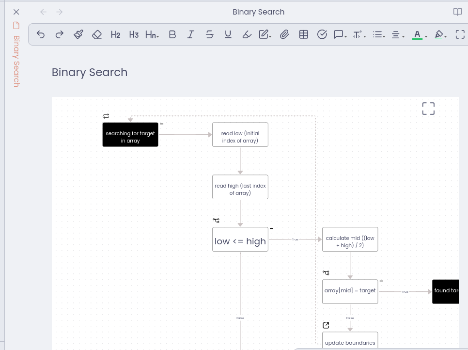
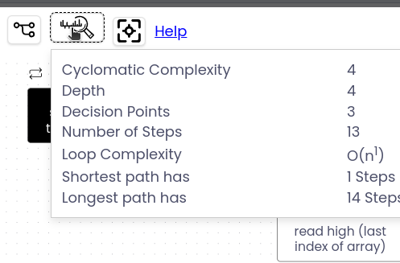
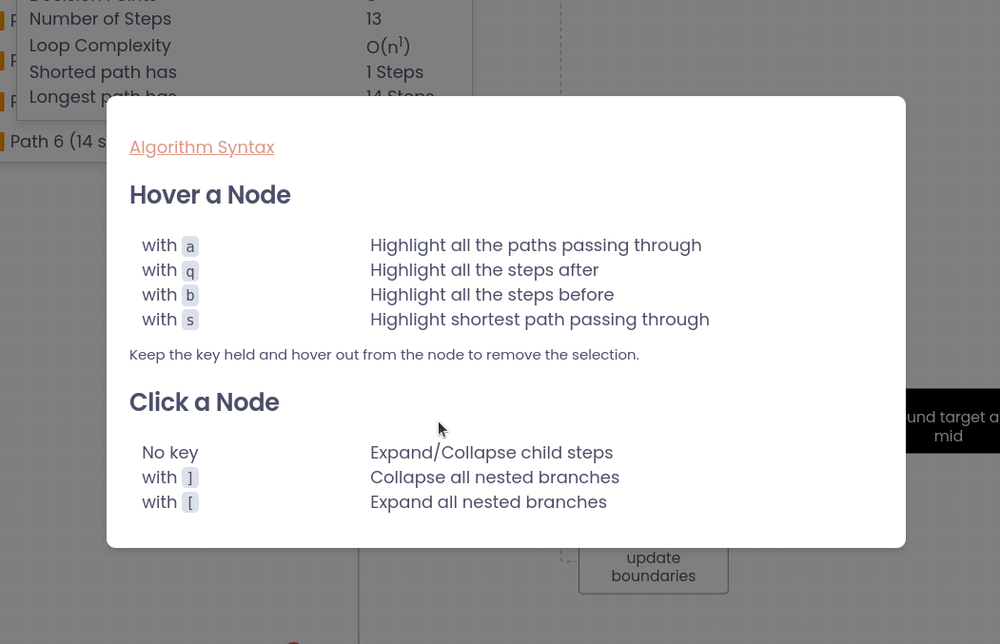
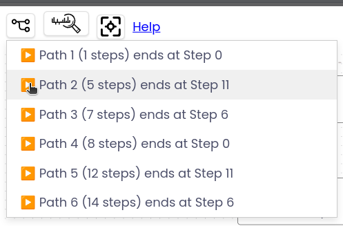

# Text2Chart FlowChart Obsidian Plugin

This plugin is the integration of Text2Chart library into obsidian so that you can create inline interactive flow charts in your notes.

## Features
- Draw an interactive flowchart from an algorithm
- Analyse your algorithm by hovering different paths
- Expand/Collpase a branch s helpful to study big algorithms
- Generate all possible paths in your algorithm and play a path

## Important links
- [Text2Chart Github](https://github.com/solothought/text2chart)
- [Online Editor](https://solothought.com/text2chart/flow)

## Screenshots

When you click on full screen button. You see additional toolbar to use additional features

Observation about your algorithm

Shortcuts that you can use

All possible paths in your algorithm

